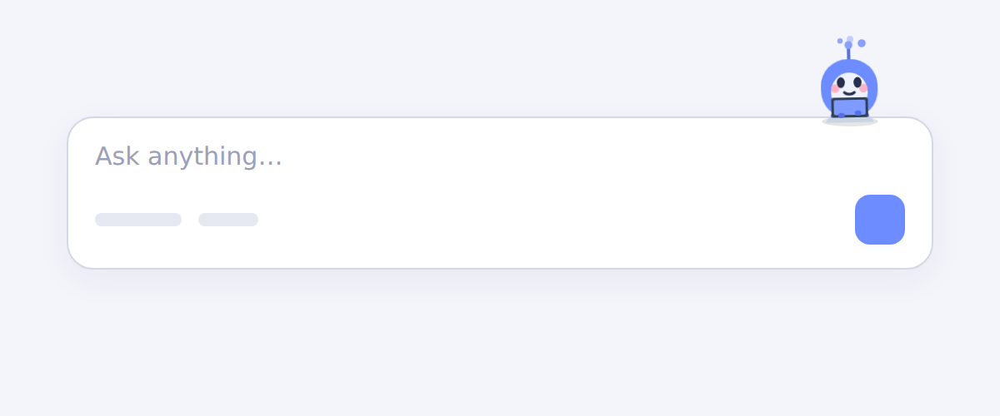
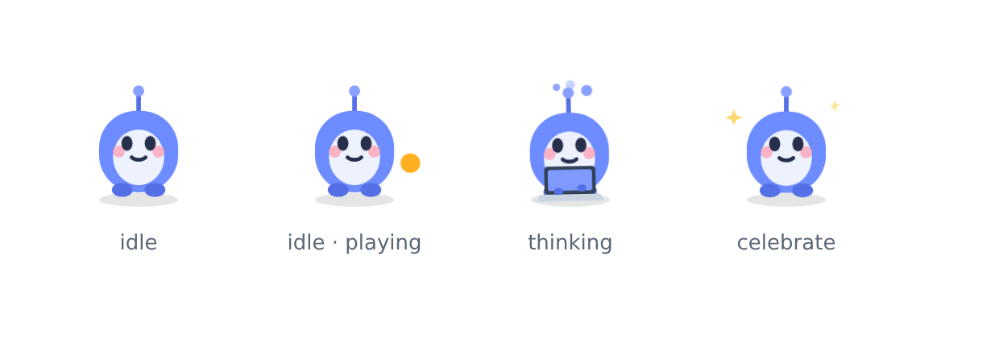

# LLocal

Aiming to provide a seamless and privacy driven chatting experience with open-sourced technologies(Ollama), particularly open sourced LLM's(eg. Llama3.1, Phi-3, Mistral). Focused on ease of use.
<br />LLocal can be installed on \***\*Windows\*\***, \***\*Mac\*\*** and \***\*Linux\*\***.

<a target="_blank" href="https://discord.gg/ygrrVJA6Th"></a>

<https://github.com/user-attachments/assets/bdfefd5d-8a55-46cf-8c63-5a7ba5e093c7>

## What can LLocal do?

- Llocaly store chats.
- Llocal utilizes Ollama which ensures that from processing to utilizing everything happens on your machine LLocally.
- Seamlessly switch between models.
- Easily pull new models.
- Image upload for models that support vision.
- Web search (i.e Website scraper aswell as duckduckgo search inbuilt) for all models.
- Chat with Files with persistence through vector db's being stored llocally. (Supported file types are PDF, PPTX, DOCX, CSV & TXT)
- Responses are rendered as markdown (Supporting Code Blocks with syntax highlighting, tabular formats and much more).
- Live preview for web based code blocks (HTML, CSS, SVG & JavaScript) rendered safely in a sandbox, with a console panel and fullscreen view.
- Multiple themes (5 themes all suporting both light and dark mode)
- Seamless integration with Ollama, from download to install.
- Slash commands — reusable prompt templates in the Claude Code format (works with collections like [wshobson/commands](https://github.com/wshobson/commands)).
- Meet **Lo**, a little composer mascot that reacts as you chat — reading while the model thinks, typing while it answers, and celebrating when it's done (opt out in Preferences).

### Slash commands

Type `/` in the chat box to browse available commands. Pick one, type your arguments after it, and send — the command's template is expanded (`$ARGUMENTS` and `$1`, `$2`, … are substituted) and the result is sent to the model.

Commands are plain markdown files, discovered from (highest priority first):

1. `~/.claude/commands` — the standard Claude Code location, so any collection installed there (e.g. `wshobson/commands`) works automatically.
2. The LLocal commands folder in your app data directory (`.../LLocal/commands`).
3. A few examples bundled with the app.

A command file's name is the command name and sub-folders become `:`-separated namespaces (so `tools/api-scaffold.md` is invoked as `/tools:api-scaffold`). Optional YAML frontmatter (`description`, `argument-hint`, `model`, `allowed-tools`) is used for the picker.

### Meet Lo

Lo is a tiny mascot that perches above the chat composer and reacts to what the app is doing — so the interface feels alive without getting in your way.



It cycles through four states, and looks right at home in both light and dark themes:

<picture>
  <source media="(prefers-color-scheme: dark)" srcset="docs/mascot/states-dark.png" />
  
</picture>

- **idle** — resting between messages (it occasionally peeks around or bats a little ball).
- **reading** — the model is thinking or running a DeepResearch web sweep; Lo scans an open book.
- **responding** — the model is writing the answer; Lo types on a tiny laptop.
- **celebrate** — a brief cheer when a run finishes.

Prefer a quieter UI? Turn Lo off any time in **Settings → Preferences → Mascot**.

## What's ahead?

- Chat with images ✅
- Web Search ☑️ (purple because, it still can be improved)
- Retrieval Augmented Generation/RAG (with single PDF's) ✅
- Multiple PDF chat ✅
- Ollama Model Catalogue (Information about all models)
- Support for `<think />` code blocks ✅
- Agents, the first two would be `DeepResearch` and `Reasoning` ✅ (auto-routed in Chat — the app decides when to reason or research; DeepResearch depth is set by an effort level)
- Code live preview for web based code (Something like what Claude Provides) ✅
- Text to Speech Models (only if we can get to be similar to a human like response) ✅
- Community wallpapers
- Community themes (something like what spicetify does)
- Lofi Music (this would be optional)
- Speech to text (Do we really need it?)
- Conversations like those with ChatGPT (Speech to text input and text to speech output, but the aim would be low-latency)
- Chat with chats ?! (Not sure)

> _At some point: would want to pivot LLocal in a different direction..._ (Although would need to discuss this with the users.)

## Important Note

LLocal's builds are unsigned at the moment, meaning there will be an unknown publisher alert on Windows and Mac. But, on mac it does not open because the code is unsigned and to solve this issue you can do either of the following:

1. Running a manual build by cloning the repo and then running the `npm run build:mac:arm` for m series or `npm run build:mac:intel` for intel based macs. When you build it on your own, that time apple does not throw the error. I know this is inconvenient but the build does take at max a few minutes.

2. Incase, you don't want to build it by yourself then you can also try the Universal build that seems to be more stable than the separate builds, but then you'd get the developer is not verified error which can be by passed by following [this video](https://m.youtube.com/watch?v=aQRbftg80kg) .

The link to the mac universal build is [this](https://github.com/kartikm7/llocal/releases/download/v1.0.0-beta.5/LLocal-1.0.0-beta.5-mac.zip).

## Project Setup

LLocal is an Electron application with React and TypeScript.

### Recommended IDE Setup (You do you, honestly)

- [VSCode](https://code.visualstudio.com/) + [ESLint](https://marketplace.visualstudio.com/items?itemName=dbaeumer.vscode-eslint) + [Prettier](https://marketplace.visualstudio.com/items?itemName=esbenp.prettier-vscode)

### Prerequisites

- **[Ollama](https://ollama.com)** installed and running. The desktop app can install/serve it for you, but you can also run it yourself: `ollama serve`. Pull at least one model, e.g. `ollama pull llama3.2`.
- **Node.js 18+** and npm.

### Installation

#### Install dependencies

```bash
npm install
```

> The desktop app talks to Ollama directly — no companion server needed. The companion server is only required for the **mobile/web** build (see below).

#### Development

```bash
npm run dev
```

#### Build

```bash
# For windows
npm run build:win

# For macOS (m-series)
npm run build:mac:arm

# For macOS (intel-chips)
npm run build:mac:intel

# For Linux (Supported now!)
npm run build:linux
```

## Companion server (for the mobile / web app)

A phone has no local filesystem or Ollama, so the mobile/web build talks to a small **companion server** that you run on the same machine as Ollama. It proxies Ollama and adds the features a browser can't do itself: RAG/file upload, web search, TTS, Git, and slash commands. **Desktop users can skip this entirely.**

```bash
cd server
npm install

# A shared secret the app authenticates with — use any hard-to-guess string.
# macOS/Linux:
LLOCAL_SERVER_TOKEN="$(openssl rand -hex 9)" npm start
# ...it prints the port it's listening on (default 8787). Note your token.
```

- Listens on **port `8787`** (override with `PORT`) and binds to all interfaces, so other devices on your network can reach it.
- Ollama is reached at `http://127.0.0.1:11434` by default (override with `OLLAMA_URL`), and re-exposed to the app under `/ollama`.
- Host command execution is **disabled** by default. Only enable it if you understand the risk: `LLOCAL_ENABLE_EXEC=1` (optionally restrict with `LLOCAL_EXEC_ALLOWLIST`).
- A GitHub token for the repo browser / PRs is optional: `GITHUB_TOKEN=...`.

### Point the app at it

In the app: **Settings → Server & Repository**, then:

| Field | Value |
| --- | --- |
| **Server URL** | `http://<host-lan-ip>:8787` |
| **Ollama base URL** | `http://<host-lan-ip>:8787/ollama` |
| **Server token** | the `LLOCAL_SERVER_TOKEN` you set |

Find `<host-lan-ip>` with `ipconfig getifaddr en0` (macOS) or `hostname -I` (Linux) — e.g. `192.168.1.22`. Use **Test server** to confirm.

> **Same network vs. remote:** the phone and the host must be able to reach each other. On the same Wi‑Fi, use the host's **LAN IP** (`192.168.x.x`). To reach it from cellular/another network you'd have to port‑forward `8787` on your router to the host and use your **public IP** — this exposes the server to the internet, so use a strong token (and prefer HTTPS via a reverse proxy). The iOS build allows plain‑`http` to any host; without a companion server the app can't reach a `localhost` address (that's the phone itself).

## Mobile app (iOS)

The mobile app is the same UI wrapped with [Capacitor](https://capacitorjs.com). Build the web bundle and open the native project:

```bash
npm run cap:ios   # build:web + copy into ios/ + open Xcode
```

Run it on a simulator/device from Xcode, or build an **unsigned `.ipa`** and sideload it with **AltStore/SideStore** (no paid Apple account needed). Step‑by‑step instructions — including the exact `xcodebuild` command and SideStore setup — are in **[MOBILE.md](MOBILE.md)**.

Once installed, configure the companion server as described above.

## How to contribute?

You can refer to the [CONTRIBUTING.md](https://github.com/kartikm7/llocal/blob/master/CONTRIBUTING.md)
